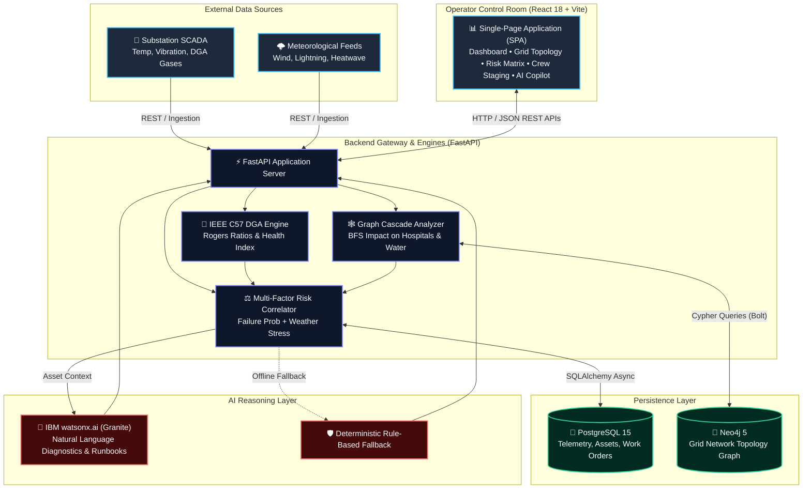
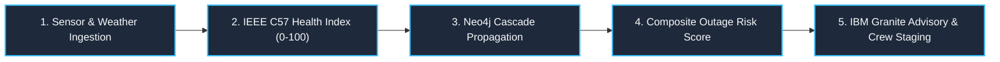

# GridPulse AI — System Architecture

**GridPulse AI** is a predictive maintenance and power outage mitigation platform built for electric utilities. It fuses substation sensor telemetry, dissolved gas analysis (DGA), severe weather forecasts, and graph-based cascade failure simulations to deliver AI-driven risk advisories and emergency crew dispatch plans.

---

## 1. System Architecture

---

## 2. End-to-End Prediction Pipeline

---

## 3. Technology Stack

| Layer | Technologies | Role |
|---|---|---|
| **Frontend** | React 18, TypeScript, Vite, Chart.js | Responsive operator dashboard & interactive grid schematic |
| **Backend** | Python 3.11, FastAPI, Uvicorn, Pydantic v2 | High-concurrency async REST API and calculation engines |
| **Relational DB** | PostgreSQL 15, SQLAlchemy Async | Stores time-series telemetry, DGA samples, assets, and work orders |
| **Graph DB** | Neo4j 5, Cypher (Async Driver) | Models transmission network topology & cascade failure propagation |
| **AI / Foundation Model** | IBM watsonx.ai + IBM Granite | Generates explainable root-cause briefs and mitigation runbooks |
| **Testing & Deployment** | Pytest (157 tests), Docker Compose | Fully automated test suite and containerized orchestration |

---

## 4. Risk Engine Formula

$$\text{Base Risk} = 0.30 \times P_f + 0.20 \times \text{HI}_{\text{risk}} + 0.15 \times W_{\text{risk}} + 0.20 \times \text{Grid}_{\text{impact}} + 0.15 \times \text{Cascade}_{\text{risk}}$$

$$\text{Final Risk Score} = \min\left(1.0, \text{Base Risk} \times \text{Critical Multiplier}\right)$$

- **Normal Asset**: $\times 1.0$
- **Important Infrastructure**: $\times 1.2$
- **Critical Facility** *(Hospital, Water Treatment, Airport)*: $\times 1.5$

---

## 5. Key API Endpoints

| Category | Method | Endpoint | Description |
|---|---|---|---|
| **System** | `GET` | `/api/v1/health` | Health check for PostgreSQL, Neo4j, and watsonx |
| **Overview** | `GET` | `/api/v1/dashboard` | Fleet risk KPIs, critical alerts, and weather status |
| **Assets & Risk** | `GET` | `/api/v1/assets` | Monitored transformer fleet with health and risk ranks |
| **Topology** | `GET` | `/api/v1/grid/topology` | Full grid single-line schematic and GIS layout |
| **Cascade** | `GET` | `/api/v1/grid/assets/{id}/impact` | Real-time graph cascade failure simulation |
| **Weather** | `GET` | `/api/v1/weather/crew-preposition` | 48-Hour field crew staging and hub pre-positioning |
| **AI Advisory** | `POST` | `/api/v1/advisory` | Asset-specific IEEE DGA diagnosis and runbook |
| **AI Chat** | `POST` | `/api/v1/advisory/chat` | Context-aware natural language copilot |
| **Work Orders** | `GET` | `/api/v1/workorders` | Open and completed maintenance work orders |
