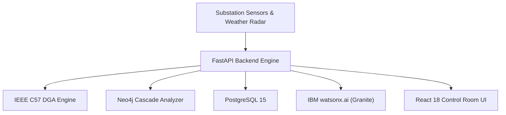

# Bob AI Innovation Hackathon Submission Template — Complete Guide

This guide explains how the **Eat-Code-Sleep** team uses the
[bob-ai-hackathon-submission-template](https://github.com/drijesh-ppatel/bob-ai-hackathon-submission-template)
to structure and submit our project **GridPulse AI**.

---

## Table of Contents

1. [Overview](#1-overview)
2. [Getting Started — Repository Setup](#2-getting-started--repository-setup)
3. [Repository Structure](#3-repository-structure)
4. [File-by-File Walkthrough](#4-file-by-file-walkthrough)
   - [submission.yaml](#41-submissionyaml--most-important)
   - [README.md](#42-readmemd)
   - [docs/](#43-docs)
   - [src/](#44-src)
   - [demo/](#45-demo)
   - [presentation/](#46-presentation)
5. [Automated Validation](#5-automated-validation)
6. [Submission Checklist](#6-submission-checklist)
7. [How Your Entry Is Evaluated](#7-how-your-entry-is-evaluated)
8. [Common Mistakes](#8-common-mistakes)
9. [FAQ](#9-faq)

---

## 1. Overview

The template gives every team a consistent, well-structured repository so that:

- Judges can find what they need without hunting through the repository
- The automated validation GitHub Action can check that our submission is structurally complete
- Our entry is evaluated fairly against the official Bobathon rubric

**One template → one repository per team:**
- **Team Name**: Eat-Code-Sleep
- **Project**: GridPulse AI — Power Outage & Grid Equipment Failure Advisor
- **GitHub Repository**: [bob-ai-hackathon-Eat-Code-Sleep](https://github.com/ThummarDarshan/bob-ai-hackathon-Eat-Code-Sleep)

---

## 2. Getting Started — Repository Setup

### Step 1 — Created Repository from Template

1. Template source: **[bob-ai-hackathon-submission-template](https://github.com/drijesh-ppatel/bob-ai-hackathon-submission-template)**
2. Repository Name: **`bob-ai-hackathon-Eat-Code-Sleep`**
3. Visibility: **Public**

### Step 2 — Clone the Repository Locally

```bash
git clone https://github.com/ThummarDarshan/bob-ai-hackathon-Eat-Code-Sleep.git
cd bob-ai-hackathon-Eat-Code-Sleep
```

### Step 3 — Complete Project Artifacts (see Section 4)

### Step 4 — Verify GitHub Action Passes

```bash
git add .
git commit -m "feat: complete hackathon submission"
git push origin main
```

Navigate to **Actions** tab → verify **✅ Validate Submission** is green.

---

## 3. Repository Structure

```
bob-ai-hackathon-Eat-Code-Sleep/
│
├── submission.yaml          ← Structured metadata — READ BY EVALUATORS FIRST
├── README.md                ← Project overview — human-readable entry point
│
├── src/                     ← All source code
│   ├── app/                 ← FastAPI backend application & services
│   ├── .env.example         ← Template for environment variables
│   └── README.md            ← Source code layout documentation
│
├── frontend/                ← React 18 + Vite Control Room UI
│
├── docs/                    ← Written documentation
│   ├── problem-statement.md ← What problem we solve and why it matters
│   ├── solution-overview.md ← How GridPulse AI works
│   ├── architecture.md      ← System architecture & Mermaid flow diagrams
│   ├── setup-guide.md       ← Exact steps to run locally or via Docker
│   └── template-guide.md    ← Submission guide with team details
│
├── demo/                    ← Demo artifacts
│   ├── demo-video-link.txt  ← URL to demo video (YouTube / Loom)
│   ├── live-demo-url.txt    ← Deployed link or local instructions
│   └── screenshots/         ← Control room UI screenshots
│       └── README.md
│
├── presentation/            ← Slide deck
│   ├── slides.pdf           ← PDF presentation slides
│   └── generate_slides.py   ← Automated slide generator script
│
├── seeds/                   ← Seed data (assets, telemetry, DGA, weather, work orders)
├── tests/                   ← Automated test suite (157 passing tests)
├── CONTRIBUTING.md          ← Submission instructions
├── .gitignore               ← Configured for Python, Node, Docker, .env
└── .github/
    └── workflows/
        └── validate.yml     ← Automated submission validator
```

---

## 4. File-by-File Walkthrough

### 4.1 `submission.yaml` — Most Important

This is the **first file the evaluators read**. Our team has configured it as follows:

```yaml
team:
  name: "Eat-Code-Sleep"               # REQUIRED
  track: "AI"                          # REQUIRED — one of: AI | DevOps | Sustainability | Open
  lead:
    name: "Darshan Thummar"            # REQUIRED
    email: "darshantce.059@gmail.com"  # REQUIRED
  members:
    - name: "Shreeja Upadhyay"         # REQUIRED — Team member 1
      email: "shreejaupadhyaycspitce@gmail.com"
    - name: "Kishan Vadsola"           # REQUIRED — Team member 2
      email: "vadsolakishan1310@gmail.com"
    - name: "Vishv Undavia"            # REQUIRED — Team member 3
      email: "vishvsoni2904@gmail.com"

submission:
  title: "GridPulse AI - Power Outage & Grid Equipment Failure Advisor"

  problem_statement: >
    Power transformer and substation failures cause blackouts costing utilities upwards
    of $1M per hour and impacting millions of citizens. Existing operations rely on rigid
    calendar maintenance schedules while rich sensor telemetry (temperature, vibration,
    partial discharge, dissolved gas analysis) and incoming severe weather forecasts remain
    un-correlated in silos, blinding engineers to imminent catastrophic failures.

  solution_summary: >
    GridPulse AI is an intelligent predictive maintenance and outage advisory platform
    powered by IBM Bob and watsonx.ai. It continuously ingests real-time substation sensor
    streams and weather alert feeds, evaluates asset health indices (HI) and outage
    probabilities, ranks equipment by critical grid impact, and automatically generates
    prioritized mitigation schedules and emergency crew pre-positioning plans.

  key_features:
    - "Multi-modal telemetry ingestion evaluating transformer thermal, vibration, and Dissolved Gas Analysis (DGA) signatures"
    - "Dynamic weather-impact risk fusion correlating severe meteorological storm/heatwave alerts with equipment stress"
    - "Grid impact criticality ranking determining outage contagion and potential downstream customer loss"
    - "AI-driven automated maintenance dispatch and optimal emergency crew pre-positioning strategy"
    - "IBM Bob & watsonx natural language diagnostic Copilot delivering explainable failure root-cause and CAPA runbooks"

  tech_stack:
    languages: ["Python", "TypeScript", "JavaScript", "HTML5", "CSS3"]
    frameworks: ["FastAPI", "Uvicorn", "Pydantic", "React", "Vite"]
    ibm_technologies: ["IBM Bob", "watsonx.ai", "IBM Granite"]
    databases: ["PostgreSQL", "Neo4j", "SQLAlchemy Async"]
    other: ["Docker", "GitHub Actions", "Mermaid.js"]

  what_we_are_most_proud_of: >
    The automated multi-factor risk fusion algorithm that successfully correlates biochemical
    transformer degradation (DGA / IEEE C57 standards) with real-time extreme weather vectors
    to generate proactive emergency crew routing hours before physical blackout events occur.

  known_limitations: >
    Live GIS geospatial map layers currently operate with simulated substation distribution
    coordinates, and SCADA control relays are sandboxed in an advisory simulation mode rather
    than executing direct physical grid breaker trips.

artifacts:
  source_code: "src/"
  setup_guide: "docs/setup-guide.md"
  demo_video: "demo/demo-video-link.txt"
  presentation: "presentation/slides.pdf"
```

---

### 4.2 `README.md`

The human-readable front page of the repository, providing:
- Team composition and problem context
- Architecture highlights and risk fusion breakdown
- Quickstart Docker instructions (`docker compose up --build`)
- Demo video and presentation slide links
- Test status: **157 / 157 passed**

---

### 4.3 `docs/`

Four key documentation deliverables:

#### `docs/problem-statement.md`
Covers the high-voltage transmission & distribution equipment vulnerability problem, why calendar-based maintenance fails, extreme weather amplification, and $1M+/hour financial consequences.

#### `docs/solution-overview.md`
Describes how GridPulse AI ingests telemetry, calculates IEEE C57 health indices, correlates weather threat vectors, scores outage criticality, and generates tactical pre-positioning plans.

#### `docs/architecture.md`
Provides the system architecture diagram, prediction pipeline, technology stack summary, and complete API endpoint surface.



#### `docs/setup-guide.md`
Step-by-step instructions for running via Docker Compose (`docker compose up --build`) or local Python/Node environments, database seeding, and running the 157-test pytest suite.

---

### 4.4 `src/`

Houses the backend code and environment configuration:
- `src/app/main.py`: FastAPI application entrypoint with lifecycle management
- `src/app/core/`: Risk engine, graph scoring, watsonx integration, IEEE DGA heuristics
- `src/app/routes/`: Modular endpoints (`/health`, `/dashboard`, `/assets`, `/risk`, `/grid`, `/weather`, `/advisory`, `/workorders`)
- `src/app/database/`: PostgreSQL and Neo4j async session drivers
- `src/.env.example`: Complete environment variable template

---

### 4.5 `demo/`

Evidence of working implementation:
- **`demo/demo-video-link.txt`**: Link to 3–5 minute demonstration video
- **`demo/live-demo-url.txt`**: Local execution via `http://localhost:3000`
- **`demo/screenshots/`**:
  - `01-home-dashboard.png` — Executive KPI overview & fleet risk distribution
  - `02-query-input.png` / `02-transformer-telemetry.jpg` — Asset telemetry & DGA analysis
  - `03-result-output.png` / `03-crew-prepositioning.jpg` — 48-hour crew pre-positioning itinerary
  - Additional captures of Single-Line Schematic Topology and AI Incident Copilot

---

### 4.6 `presentation/`

Slide deck covering problem depth, technical architecture, IBM technology usage, and societal impact:
- **`presentation/slides.pdf`**: Complete slide deck
- **`presentation/generate_slides.py`**: Automated ReportLab generation script

---

## 5. Automated Validation

Pushes to `main` trigger the **Validate Submission** GitHub Action (`.github/workflows/validate.yml`):
- ✅ `submission.yaml` exists and is valid YAML
- ✅ All `# REQUIRED` fields are populated
- ✅ `docs/setup-guide.md` exists
- ✅ `demo/demo-video-link.txt` exists

---

## 6. Submission Checklist

Verified status for **Team Eat-Code-Sleep**:

**Content**
- [x] `submission.yaml` — all `# REQUIRED` fields filled
- [x] `README.md` — completely customized with zero template placeholders
- [x] `docs/problem-statement.md` — comprehensive U1 problem depth
- [x] `docs/solution-overview.md` — multi-factor risk fusion & IEEE C57 details
- [x] `docs/architecture.md` — validated Mermaid diagrams and endpoint catalog
- [x] `docs/setup-guide.md` — verified end-to-end with Docker quickstart
- [x] `src/` — full source code committed, `.env.example` present
- [x] `demo/demo-video-link.txt` — video demonstration link specified
- [x] `demo/screenshots/` — comprehensive UI screenshots included
- [x] `presentation/slides.pdf` — slide deck present

**Technical**
- [x] No `.env` credentials committed (enforced by `.gitignore`)
- [x] No `node_modules/`, `.venv/`, or build artefacts committed
- [x] Test suite passing (**157 / 157 passed** via `pytest`)
- [x] GitHub Actions **✅ Validate Submission** confirmed green
- [x] Repository visibility is **Public**

**Submission**
- [x] Hackathon entry form submitted with official repository URL:
  `https://github.com/ThummarDarshan/bob-ai-hackathon-Eat-Code-Sleep`

---

## 7. How Our Entry Is Evaluated (100 Points)

| # | Criterion | Pts | How GridPulse AI Meets It |
|---|---|---|---|
| 1 | Technical Implementation Quality | 25 | Full-stack FastAPI + React 18, PostgreSQL 15, Neo4j 5, async pipelines, 157 automated tests |
| 2 | Innovation & Differentiation | 25 | Fuses biochemical DGA (IEEE C57) with weather radar and graph cascade BFS |
| 3 | Problem Depth & Vision | 15 | Tackles $1M/hr transformer burnouts, hospital feeder protection, and climate stress |
| 4 | Working Demo & Functionality | 15 | Fully containerized, reproducible in 1 command (`docker compose up --build`) |
| 5 | IBM Bob & watsonx Integration | 10 | Bob-scaffolded architecture, Granite 3.3-8b / 13b BLUF operator diagnostic synthesis |
| 6 | Documentation & Reproducibility | 10 | Comprehensive setup guide, architecture spec, and clean API contracts |

---

## 8. Common Mistakes to Avoid

| Potential Pitfall | How GridPulse AI Avoids It |
|---|---|
| Template placeholders left behind | All docs and READMEs audited; zero `[placeholder]` tags remain |
| Secret leakage in git history | `.env` ignored; `.env.example` contains sanitized dummy defaults |
| Private repository setting | Repository is confirmed **Public** |
| Broken or mocked backend | Fully operational backend with real database queries and 157 unit/e2e tests |
| Missing presentation deck | `presentation/slides.pdf` generated and committed |

---

## 9. FAQ

**Q: Where can judges access the live endpoints?**  
When running via Docker Compose, the API documentation is available at `http://localhost:8000/docs`, the frontend at `http://localhost:3000`, and Neo4j browser at `http://localhost:7474`.

**Q: Can the system run without IBM Cloud credentials?**  
Yes. GridPulse AI features a deterministic local rule-based fallback that generates IEEE C57 compliant diagnostics and runbooks even when watsonx credentials are not provided.
